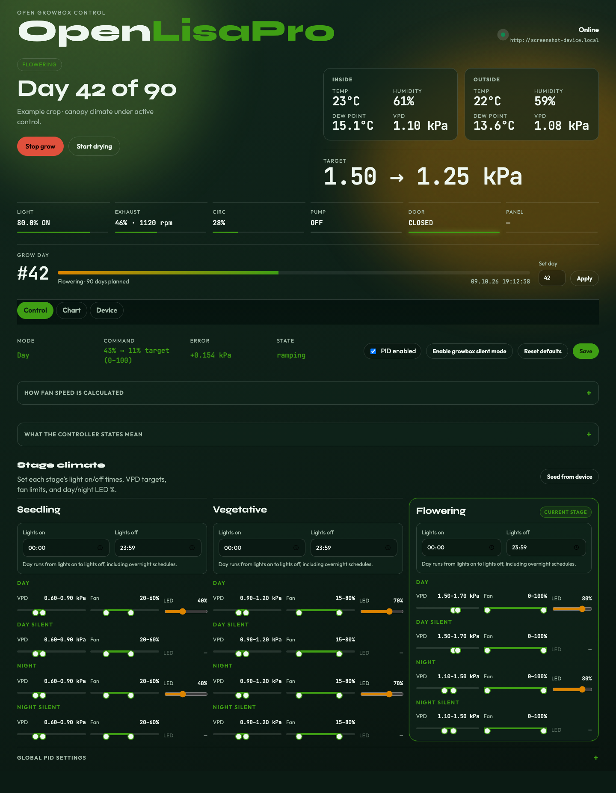
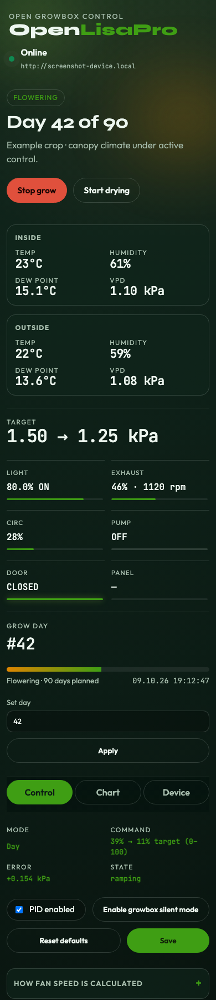

# OpenLisaPro

OpenLisaPro is a self-hosted web dashboard and Python client for Lisa Pro / LuminaGrowX growboxes. The dashboard reads live climate and device status, lets you manage growbox settings, and can run a local fan controller that adjusts exhaust speed to help maintain a VPD target.

The web app runs on your own computer or server. It talks to the growbox over its HTTP API; the browser talks only to the local Flask app. Local VPD, fan, LED, schedule, and PID overrides are stored on disk in `control.json`.

## What it does

- Shows inside and outside temperature, relative humidity, dew point, and VPD, along with the current grow stage and device status.
- Lets you manage stage-specific VPD targets, fan limits, LED levels, and light-on/light-off schedules for day, Day silent, night, and Night silent modes.
- Runs an optional local PID controller for exhaust fan speed. It uses inside VPD as the control goal, estimates the ventilation limit from outside dew point at inside temperature, observes each stage's fan limits, and ramps changes to avoid abrupt speed shifts.
- Displays the controller's current mode, status, and ramp target, with an expandable explanation of the calculation and its states.
- Provides a chart of recent climate and fan history, and controls for growbox settings such as silent operation, door actions, and MQTT.
- Includes `LisaProClient`, a small typed Python wrapper for the growbox API.

The UI can be viewed on desktop or mobile. The PID loop can write fan settings to the connected device when enabled, so use the controller settings deliberately.

## Screenshots

These screenshots use mock device data and show the dashboard at desktop and mobile widths, including stage-specific Day silent/Night silent settings and the growbox silent schedule toggle. The example has a requested VPD target of 1.50 kPa; outside dew point limits the ventilation-achievable target to 1.25 kPa, so the fan command ramps down instead of chasing an unreachable target. The mock server does not connect to a growbox.





## Requirements

- Python 3.9 or newer
- [`uv`](https://docs.astral.sh/uv/) for dependency and environment management
- A Lisa Pro / LuminaGrowX device reachable over HTTP to use live device features

## Setup and run

Clone the repository, then install the project and its dependencies:

```bash
uv sync
```

Set the device's base URL and start the dashboard:

```bash
LISA_PRO_URL=http://192.168.1.50 uv run lisa-pro-ui
```

Replace the example address with the address of your growbox. Open [http://127.0.0.1:5050](http://127.0.0.1:5050) in a browser on the same computer. To access the dashboard from another device on your local network, use the host computer's LAN address and keep the app bound to a trusted network.

The app binds to `0.0.0.0` by default. You can choose a different bind address and port with environment variables:

```bash
HOST=127.0.0.1 PORT=5050 LISA_PRO_URL=http://192.168.1.50 uv run lisa-pro-ui
```

`LISA_PRO_DATA` selects the directory for local control settings. It defaults to `./data`; the settings file is `control.json` inside that directory. Keep this file if you want to preserve your local overrides between runs.

| Variable | Default | Purpose |
| --- | --- | --- |
| `LISA_PRO_URL` | `http://192.168.178.242` | Growbox base URL |
| `LISA_PRO_DATA` | `./data` | Directory for local control settings |
| `HOST` | `0.0.0.0` | Address for the web server to bind to |
| `PORT` | `5050` | Web server port |
| `FLASK_DEBUG` | `0` | Enable Flask debug mode when set to `1` |

## Using local fan control

Open the **Control** tab to configure per-stage VPD targets and fan limits. The **Chart** tab shows recent history, and the **Device** tab contains growbox settings. PID tuning settings are collapsed by default. Expand them to adjust the gains, ramp rate, update interval, and deadband.

Enable local PID control to let OpenLisaPro command the exhaust fan. The live status shows the current fan command; while it is ramping, it also shows the target speed. The configured light-on and light-off times for the active stage determine whether the controller uses day or night settings. The LEDs' current on/off state does not define the scheduled day/night mode.

### VPD target and outside dew point

Inside VPD remains the PID control goal because it reflects the current conditions around the plants. The controller also estimates the highest VPD ventilation can produce using outside dew point. Dew point represents incoming-air moisture content; the controller evaluates it at the inside temperature so that outside and inside VPD are compared at the same temperature. When the requested target is above this estimate, the PID uses the achievable limit and the dashboard shows both values.

For example, outside air at 22°C and 59% RH has a dew point near 13.6°C. At an inside temperature of 23°C, that moisture level corresponds to about 1.25 kPa VPD. A requested target of 1.50 kPa is therefore limited to about 1.25 kPa for ventilation control. This is an estimate of what ventilation alone can achieve; moisture produced inside the grow space can reduce the actual result.

The **Reset defaults** action restores local control defaults and the growbox's factory phase presets. Stage and device settings may be written to the connected hardware when you save or reset them.

Use **Enable growbox silent mode** or **Disable growbox silent mode** in the Control tab to toggle the device's silent schedule through its settings API. The growbox applies silent operation during the configured silent hours. The local PID uses the device's reported active state to select Day silent or Night silent fan limits.

## Python client

The package also exposes `LisaProClient` for scripts that need to call the device API directly:

```python
from lisa_pro_ui import LisaProClient

with LisaProClient("http://192.168.1.50") as box:
    status = box.status()
    print(status["temp_c"])
    box.grow_start(total_days=90, seed="Basil", start_day=1)
```

`LisaProClient` supports device status, grow and drying controls, phase and settings management, network operations, notifications, and update routes. `LisaProError` includes the HTTP status and response body when the device reports an error. See [`openapi.yaml`](openapi.yaml) for the documented API surface and [`examples/`](examples/) for sample payloads.

## Project layout

```text
src/lisa_pro_ui/
  app.py                 Flask routes and app factory
  client.py              Typed HTTP client for the growbox
  config_store.py        Local settings, defaults, and normalization
  controller.py          Background VPD-to-fan PID controller
  pid.py                 PID calculation
  vpd.py                 VPD and dew-point calculations
  templates/index.html   Dashboard markup
  static/css/app.css     Responsive dashboard styles
  static/js/app.js       Browser behavior and chart rendering
openapi.yaml             Growbox HTTP API reference
tests/                   Automated tests
```

## Development

Install development dependencies and run the test suite with:

```bash
uv sync --group dev
uv run pytest
```

For isolated app use, `create_app(device_url=..., data_dir=..., start_controller=False)` creates the Flask app without starting the background controller. The tests use Flask's test client and temporary settings directories; no physical growbox is needed for those tests.
